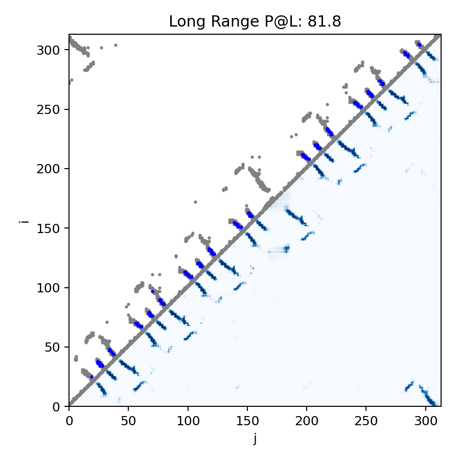

Residue-Residue Contact Prediction with ESM2 + Template Priors
===

# Description

This repo extends Meta's ESM2 contact head by injecting structural priors from sequences similar to the query (via MMseqs2). I combine:

1. per-residue ESM2 embeddings and logits
2. template-derived pairwise priors

and learn a light 2D CNN head to produce a contact map.

# Model components

- ESM2 backbone with optional frozen weights; can reuse ESM2 contact logits.
- Template priors from similar sequences:
  - Contact prior (Cα-Cα < 8Å)
  - Discretized distance-bin priors (e.g., 0-6Å, 6-8Å, 8-10Å, 10-14Å, >14Å)

# Method Overview

1. **Sequence encoder (ESM2)**
   * Uses `esm2_t30_150M_UR50D` (default, configurable) to extract per-residue embeddings.
   * Computes ESM2’s native contact logits as additional pairwise features.
2. **Template retrieval and alignment (MMseqs2)**
   * Searches for top-k similar chains within the training database.
   * Extracts each template’s contact map and distance matrix.
   * Aligns templates to the query and projects structural priors to query indices.
   * Filters templates by sequence identity and coverage; aggregates weighted priors.
3. **Pairwise Fusion Network**
   * Constructs pairwise features from sequence embeddings:
     `[H_i + H_j, |H_i − H_j|, H_i ⊙ H_j]`.
   * Concatenates with template priors (contact + distance bins).
   * A shallow 2D CNN refines these into contact probabilities.
   * Training uses `BCEWithLogitsLoss` over the upper triangle (|i−j| ≥ sep_min, default 6).
4. **Evaluation Metrics**
   * `Precision@L`, `Precision@L/2`, `Precision@L/5`.

# Installation

### Environment

This setup was tested on Ubuntu 22.04 with Python 3.11 and CUDA-enabled PyTorch.

#### 1. Install MMseqs2 (tested on `13-45111+ds-2`)

```bash
sudo apt install mmseqs2
```

#### 2. Create and activate a Python virtual environment

```bash
mkvirtualenv protein -p python3.11

python -m pip install --upgrade pip

pip install -r requirements.txt
```

# Usage

## Data expectations

This repo expects the following data structure:

```
data/
    train/*.pdb
    test/*.pdb
```

where the pdb files contain the protein structures for training and testing.

## Data preparation

To run the data preparation step, you need to have the raw PDB files organized as shown above. The data preparation script will convert these PDB files into the required `.npz` format containing the necessary features for training and evaluation.

Run the data preparation script to generate the processed data:

```bash
bash scripts/1-data_preparation.sh
```

Replace the paths in the script as needed.

After running the script, you should have the following structure:

```
data/
    train/*.pdb
    test/*.pdb
    processed/
        train/*.npz
        test/*.npz
    mmseqs_results/
        result.tsv
```

with the processed `.npz` files ready for training and evaluation, and MMseqs2 results stored in `mmseqs_results/` with the file `result.tsv` used for template retrieval (built from the train set as the database).

A base parameter file for data preparation can be found in [base_parameters.py](data_preparation/base_parameters.py)

You typically won’t need to modify this unless adjusting preprocessing logic.

## Configuration (hyperparameters)

Training and evaluation parameters are managed through YAML configs in `cfg/`.

Example ([config-v2.yaml](src/cfg/config-v2.yaml)):
```yaml
data:
  processed_dir: "~/MyData/esm2-residue_contact/processed"
  mmseqs_tsv: "~/MyData/esm2-residue_contact/processed/mmseqs_results/result.tsv"
  train_split: train
  val_split: test

loader:
  num_workers: 8

model:
  esm_model: esm2_t30_150M_UR50D  # Max model that fits in 11GB GPU with batch size 1
  freeze_esm: true
  use_esm_contact_head: true
  cnn_channels: 96
  cnn_depth: 8
  dropout: 0.1
  top_k_templates: 5  # number of templates to use
  distance_bins: [6.0, 8.0, 10.0, 14.0]
  sep_min: 6  # min sequence separation for contact prediction
  max_len: 512  # max length during training
  sep_min_eval: 6
  max_len_eval: 640  # max length during evaluation

optim:
  lr: 0.0001
  weight_decay: 0.01
  betas: [0.9, 0.98]
  warmup_steps: 500
  max_steps: 200_000
  grad_accum: 1
  batch_size: 1

train:
  log_every: 50
  eval_every: 1000
  save_every: 2000
  out_dir: "~/MyTmp/esm2-residue_contact/outputs-v2"

loss:
  pos_weight: 3.  # weight for positive class in BCEWithLogitsLoss

eval:
  split: test
```

## Run baseline evaluation

To evaluate the baseline ESM2 contact head without template priors, use the following command:
```bash
bash scripts/2-baseline.sh
```
adapt the paths in the script as needed.

## Run the training

To train the model, use the following command:
```bash
bash scripts/3-train.sh
```
adapt the paths to the configuration file and output directory as needed.

## Run a simple evaluation

To evaluate the model, use the following command:
```bash
bash scripts/4-eval.sh
```
adapt the paths to the configuration file and checkpoint as needed.

## Run a deeper analysis

To evaluate the model, use the following command:
```bash
bash scripts/5-analysis.sh
```
adapt the paths to the configuration file and checkpoint as needed.

# Results and analysis

I evaluated the model on a held-out test set of 500 molecules (L ≤ 640) with MMseqs2 templates retrieved from the training set.

## Overall performance

The ESM2 + Template Priors model significantly outperforms the pure sequence-based ESM2 Baseline, confirming that template-derived structural priors greatly enhance contact prediction accuracy, especially at longer residue separations.

I achieved the following results with sequence separation |i-j| ≥ 6, and a maximum sequence length of 640 for evaluation (due to GPU memory limits):

| Model                                  | P@L        | P@L/2      | P@L/5      |
|----------------------------------------| ---------- | ---------- | ---------- |
| **ESM2 Baseline**                      | 0.4297     | 0.5290     | 0.6391     |
| **ESM2 + Template priors (config-v1)** | 0.6808     | 0.8084     | 0.8952     |
| **ESM2 + Template priors (config-v2)** | **0.7043** | **0.8273** | **0.9059** |

I used the following configurations for the experiments (provided in `cfg/`):
* `config-v1.yaml`: `esm2_t30_150M_UR50D` + template priors with a small CNN head
* `config-v2.yaml`: `esm2_t30_150M_UR50D` + template priors with a larger CNN head
* baseline ESM2 contact head only

The training on `config-v2.yaml` took approximately 15 hours on a single NVIDIA GTX 1080 Ti GPU, and it was stopped even though the performance was still improving due to time constraints.

### Range-specific metrics

| Range              |    P@L |    P@L/2 |    P@L/5 | AUPRC |
| :----------------- |-------:|---------:|---------:| ----: |
| **Short (6-11)**   |   0.27 |     0.45 |     0.70 |  0.66 |
| **Medium (12-23)** |   0.30 |     0.47 |     0.69 |  0.60 |
| **Long (≥ 24)**    |   0.53 |     0.69 |     0.81 |  0.49 |

Long-range precision remains solid but shows room for improvement, suggesting future work could focus on better modeling of distant dependencies.

## Precision vs. sequence separation


Similar trends are observed across different sequence length, with a high correlation between precision and prevalence at each separation bin.

## Example of contact map visualization

Below is an example of a predicted protein contact map for a test case.
The plot illustrates the predicted residue-residue contacts (blue) compared to the true contacts (gray), providing a visual measure of model performance.




## Hardware requirements

- Training: 
  - The performance reports were obtained using one **NVIDIA GTX 1080 Ti GPUs with 11GB** memory.
  - The `esm2_t30_150M_UR50D` was the largest model that fit in this memory with **batch size 1**.
  - The provided configurations `config-v2.yaml` is the larger custom model that fits in 11GB.
  - The `seq_len` was capped at **512** residues during training due to memory constraints.
- Evaluation/Inference:
  - The `seq_len` was capped at **640** residues during evaluation.

## Future Improvements

To further enhance performance and robustness, several extensions are possible:

1. **Larger and more diverse training data**
   * Include longer sequences and additional PDB chains to improve generalization for large proteins.
2. **Curriculum or weighted sampling**
   * Modify the dataloader to oversample proteins with more long-range contacts, balancing the natural short-range dominance.
3. **Distance-aware loss functions**
   * Weight the BCE loss by residue separation or by distance bins to penalize long-range errors more heavily.
4. **Multi-task training**
   * Jointly predict both contact probability and coarse distance bins, improving geometric consistency.
5. **Transformer-based pairwise fusion**
   * Replace or augment the CNN head with a 2D attention block to better model complex inter-residue dependencies.
6. **Ensemble and calibration**
   * Combine multiple checkpoints or architectures to smooth variance and improve reliability in low-confidence regions.

# References

This project uses:
- Scientific background on residue-residue contact prediction:
  - https://journals.plos.org/ploscompbiol/article?id=10.1371/journal.pcbi.1005324
- **ESM2** from Meta AI: 
  - https://github.com/facebookresearch/esm
  - Contact prediction example notebook: https://github.com/facebookresearch/esm/blob/main/examples/contact_prediction.ipynb
- **MMseqs2** for fast sequence search & alignments: 
  - https://github.com/soedinglab/MMseqs2
  - https://mmseqs.com/latest/userguide.pdf
- **ChatGPT** for code assistance, documentation drafting, and problem understanding.
